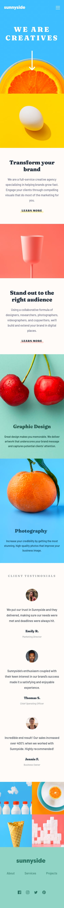

# Frontend Mentor - Sunnyside agency landing page solution

This is a solution to the [Sunnyside agency landing page challenge on Frontend Mentor](https://www.frontendmentor.io/challenges/sunnyside-agency-landing-page-7yVs3B6ef). Frontend Mentor challenges help you improve your coding skills by building realistic projects.

## Table of contents

- [Overview](#overview)
  - [The challenge](#the-challenge)
  - [Screenshot](#screenshot)
  - [Links](#links)
- [My process](#my-process)
  - [Built with](#built-with)
  - [What I learned](#what-i-learned)
  - [Continued development](#continued-development)
  - [Useful resources](#useful-resources)
- [Author](#author)
- [Acknowledgments](#acknowledgments)

**Note: Delete this note and update the table of contents based on what sections you keep.**

## Overview

### The challenge

Users should be able to:

- View the optimal layout for the site depending on their device's screen size
- See hover states for all interactive elements on the page

### Screenshot




-[mobile design](./screenshots/mobile-view.png)
-[desktop preview](./screenshots/desktop-view.png)

### Links

- Solution URL: [Solution URL](https://www.frontendmentor.io/solutions/responsive-landing-page-using-css-flexbox-f7wwnBubd)
- Live Site URL: [Live site URL](https://decaptaindan.github.io/sunnyside-agency-landing-page-main/)

## My process

### Built with

- Semantic HTML5 markup
- CSS custom properties
- Flexbox
-[The font family I imported](https://fonts.googleapis.com/css2?family=Barlow:wght@600&family=Fraunces:wght@700;900&display=swap)


### What I learned

I learnt how to use more css properties and html elements. I also learnt how to design a drop down menu using CSS.

```CSS
.dropdown{
        position: relative;
        float: right;
        display: inline;
        align-self: center;
    }

    .menu {
        cursor: pointer;
    }

    .dropdown-content {
        display: none;
        position: absolute;
        background-color: white;
        box-shadow: 0px 8px 16px 0px rgba(0,0,0,0.2);
        z-index: 1;
        right: 0;
        text-align: center;
        padding: 20px 20px 30px;
        font-size: 16px;
    }

    .dropdown-content a {
        color: hsl(210, 4%, 67%);
        padding: 12px 18px;
        text-decoration: none;
        display: block;
        font-family: 'Barlow', sans-serif;
    }

    .dropdown:hover .dropdown-content {
        display: block;
    }

    .menus:hover{
        fill: #6FCFFF;
    }

    #contact-menu{
        background-color: hsl(51, 100%, 49%);
        font-family: 'Fraunces', serif;
        text-transform: uppercase;
        color: hsl(212, 27%, 19%);
        border-radius: 30px;
        font-size: 12px;
        margin-top: 15px;
    }

    nav{
        display: none;
    }
```

### Continued development

- I'm still interested in learning more CSS properties in order to add more styles to my work.

- Adding tailwindcss to my work in future works will be great. So I will also develop my skills in that area as well

### Useful resources

[w3Schools](https://my-learning.w3schools.com/). This site enhanced my CSS and HTML understanding
[CSS tricks](css-tricks.com)

## Author

- LinkedIn - [Daniel Samuel](https://www.linkedin.com/in/daniel-samuel-73190017b/)
- Frontend Mentor - [@DeCaptainDan](https://www.frontendmentor.io/profile/DeCaptainDan)
- Twitter - [@DanSam24372807](https://www.twitter.com/@DanSam24372807)

## Acknowledgments

- I want to thank my mentor in SideHustle internship who showed me this site [frontendmentor](https://www.frontendmentor.io). He has really supported me in learning HTML and CSS.
- I aslo want to thank frontend mentor for this opportunity
- Thanks to [w3Schools](https://my-learning.w3schools.com/) for helping me improve my knowledge on HTML and CSS
